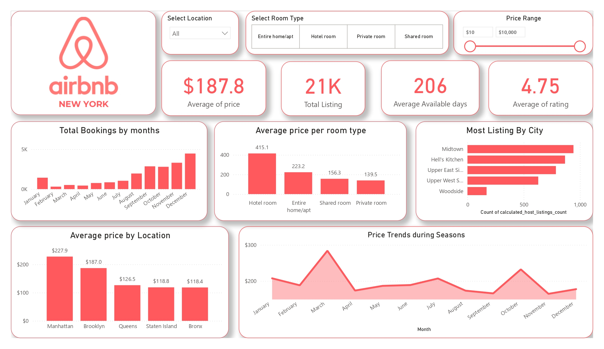

# 🏙️ NYC Airbnb Price Prediction with Multiple Linear Regression

This project explores and models Airbnb listing prices in New York City using a dataset from 2024. The objective is to understand which features impact listing prices the most, and build a predictive model using **Multiple Linear Regression (MLR)**.

---

# 📊 Project Workflow

### 1. **Data Cleaning**
- Removed missing and irrelevant values
- Handled outliers in price and minimum nights
- Converted data types as needed

### 2. **Exploratory Data Analysis (EDA)**
- Visualized distributions of numerical features
- Analyzed correlations between price and other variables
- Observed trends in room types, reviews, and ratings

### 3. **Feature Engineering**
- Converted categorical variables (e.g. `room_type`) using encoding
- Selected relevant numeric and encoded features for modeling

### 4. **Modeling: Multiple Linear Regression**
- Trained MLR model on cleaned data
- Evaluated model using:
  - **R² Score**: 0.33 (model explains ~33% of price variance)
  - **Mean Squared Error**: $10,818 (~$104 average prediction error)
- Analyzed feature coefficients to interpret price influences

### 5. **Insights**
- Most impactful features:
  - Positive: `baths`, `rating`, `bedrooms`, `beds`
  - Negative: `room_type`, `minimum_nights`, `reviews_per_month`
- Feature impact was interpreted using model coefficients

---

## 📄 Final Report
A detailed report (including visuals, interpretations, and suggestions for model improvement) is available as a PDF:

📎 

---

## 📌 Tools Used
- Python (Pandas, NumPy, Matplotlib, Seaborn, scikit-learn)
- Jupyter Notebook
