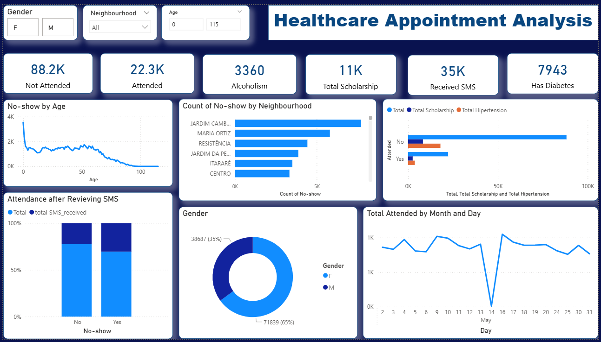

# 🏥 Medical No-Show Analysis

## 📌 Project Overview

This project aims to analyze and predict patient behavior regarding medical appointment attendance using real-world data from Brazil. Specifically, it explores what factors influence whether a patient shows up for a scheduled medical appointment. The analysis includes data cleaning, exploratory data analysis (EDA), machine learning modeling, and dashboard reporting using Power BI.

---

## 📊 Dashboard Highlights

A Power BI dashboard was developed to visually communicate insights from the data. The dashboard provides:

- No-show rate breakdown by **age**, **gender**, and **neighbourhood**
- Impact of **SMS reminders** on attendance
- Relationships between **health conditions** (e.g., diabetes, hypertension) and appointment attendance
- Trends over time (by **day and month**) to detect behavioral patterns
- Interactive filters for demographic exploration

## 📎Dashboard

---

## 🧰 Tools and Technologies

- **Python (Jupyter Notebook)**: For data preprocessing, visualization, and model training
- **Libraries Used**: `pandas`, `numpy`, `matplotlib`, `scikit-learn`
- **Power BI**: For building an interactive dashboard
- **Git** & **GitHub**: For version control and project sharing

---

## 🧪 Project Steps

### 1. Data Collection & Loading
- Dataset loaded using `pandas.read_csv()` from the [Kaggle Medical Appointment Dataset](https://www.kaggle.com/joniarroba/noshowappointments).

### 2. Data Preprocessing
- Removed irrelevant columns (e.g., `PatientId`, `AppointmentID`)
- Handled data types for date/time fields
- Created new features: 
  - Day of the week from `AppointmentDay`

### 3. Exploratory Data Analysis (EDA)
- Visualized age distributions, gender ratios, and no-show rates
- Identified top neighbourhoods with high no-show volumes
- Investigated correlation between no-show behavior and medical conditions

### 4. Feature Engineering
- Label encoded categorical features (`Gender`, `No-show`)

### 5. Machine Learning
- Split data into training and test sets (80/20)
- Trained a **Decision Tree Classifier**
- Achieved approx. **80% accuracy**
- Analyzed feature importances (e.g., `SMS_received`, `Age`)

### 6. Dashboard Development
- Built an interactive Power BI dashboard to:
  - Visualize key metrics
  - Allow drill-down by demographics and conditions
  - Present actionable insights to stakeholders

---

## 📈 Key Insights

- The **overall no-show rate is ~80%**, suggesting a significant inefficiency in patient follow-through.
- **Younger patients** are more likely to miss appointments, while attendance increases with age.
- **SMS reminders have a slight positive effect**, but are not sufficient alone.
- Certain **neighbourhoods consistently report higher no-show rates**, which could indicate geographic or socioeconomic barriers.
- **Health conditions** like hypertension and diabetes do not significantly increase show-up rates despite higher medical needs.

---
